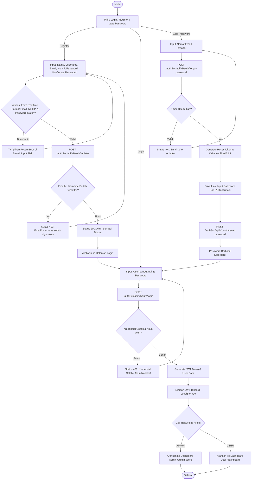
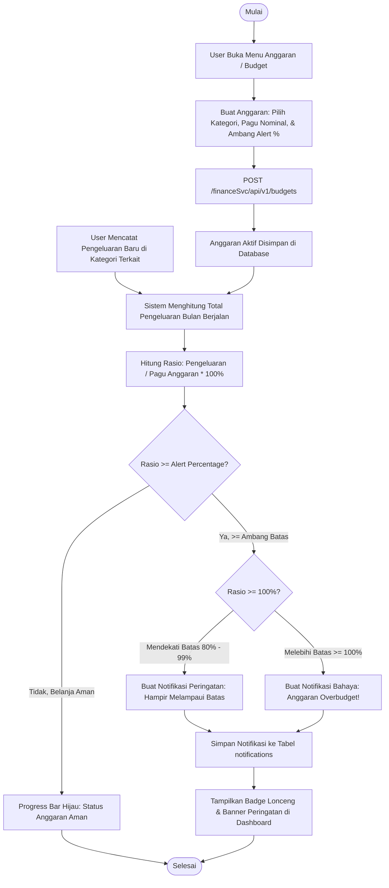
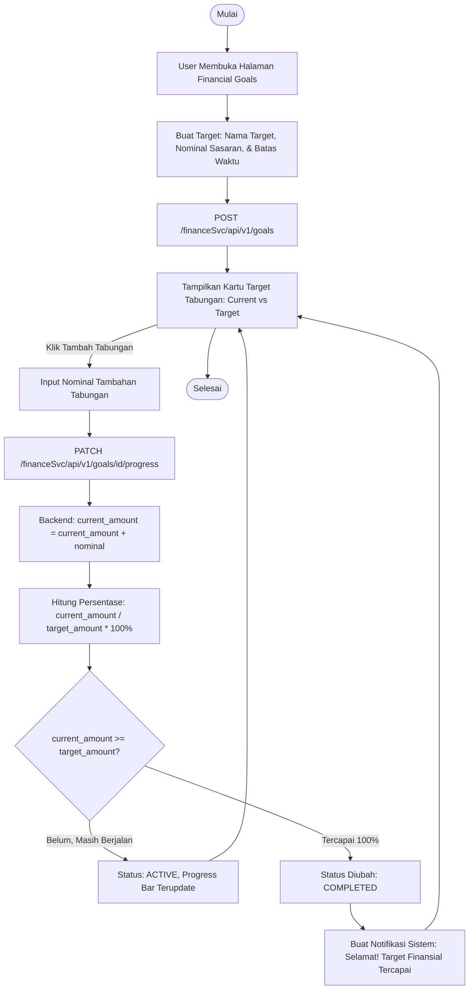
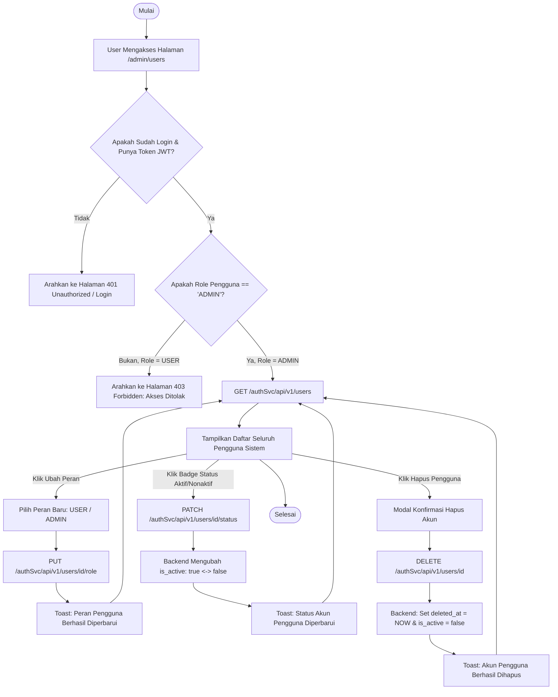

# 📊 DOKUMENTASI FLOWCHART SISTEM CUANFLOW
**Personal Finance Management System**  
*Program Studi S1 Akuntansi & Sistem Informasi*

---

## 📑 Daftar Isi
1. [Flowchart 1: Alur Autentikasi & Keamanan (Auth Flow)](#1-alur-autentikasi--keamanan-auth-flow)
2. [Flowchart 2: Alur Transaksi Keuangan & Bukti Struk (Transaction CRUD & Upload)](#2-alur-transaksi-keuangan--bukti-struk-transaction-crud--upload)
3. [Flowchart 3: Alur Pengawasan Anggaran & Notifikasi Overbudget](#3-alur-pengawasan-anggaran--notifikasi-overbudget)
4. [Flowchart 4: Alur Target Finansial (Financial Goal & Savings Progress)](#4-alur-target-finansial-financial-goal--savings-progress)
5. [Flowchart 5: Alur Manajemen Pengguna Khusus Admin (RBAC Admin User Management)](#5-alur-manajemen-pengguna-khusus-admin-rbac-admin-user-management)

---

## 1. Alur Autentikasi & Keamanan (Auth Flow)

Diagram alir ini menggambarkan proses pendaftaran akun baru, login dengan validasi JWT token, persistensi session, dan penanganan pemulihan kata sandi (*Forgot Password*).



---

## 2. Alur Transaksi Keuangan & Bukti Struk (Transaction CRUD & Upload)

Diagram alir proses penambahan, penelaahan rincian (*detail*), filter/sorting simultan, pengunggahan bukti bayar (gambar/PDF), dan penghapusan transaksi (*soft delete*).

```mermaid
flowchart TD
    Start([Mulai]) --> ViewTx[Buka Halaman Transaksi]
    ViewTx --> FetchTx[GET /financeSvc/api/v1/transactions]
    FetchTx --> RenderTable[Tampilkan Tabel Transaksi, Pagination, & Total Data]
    
    %% Filter & Search
    RenderTable --> FilterAction[Terapkan Search Keyword / Kategori / Status Tipe / Tanggal / Sorting]
    FilterAction --> FetchFiltered[GET /financeSvc/api/v1/transactions?keyword=...&type=...&page=0]
    FetchFiltered --> RenderTable
    
    %% Detail Modal
    RenderTable -->|Klik Ikon Mata Detail| ModalDetail[Buka Modal Detail Transaksi: Rincian Lengkap & Tag]
    ModalDetail --> DownloadAttach{Ada Lampiran Struk?}
    DownloadAttach -->|Ya| Preview[Pratinjau / Unduh File Struk Gambar atau PDF]
    DownloadAttach -->|Tidak| CloseDetail[Tutup Modal]
    
    %% Tambah / Edit
    RenderTable -->|Klik Tambah / Edit| FormTx[Isi Formulir: Judul, Tipe, Nominal, Kategori, Tag, Metode, & File]
    FormTx --> ValidateTx{Nominal > 0 & Field Wajib Lengkap?}
    ValidateTx -->|Tidak| ToastWarn[Tampilkan Toast Warning Validasi] --> FormTx
    ValidateTx -->|Ya| HasFile{Melampirkan File Struk?}
    HasFile -->|Ya| UploadFile[Upload File Bukti Struk: Gambar / PDF]
    UploadFile --> SaveTx[POST / PUT /financeSvc/api/v1/transactions]
    HasFile -->|Tidak| SaveTx
    SaveTx --> SuccTx[Toast Success: Transaksi Berhasil Disimpan]
    SuccTx --> RefreshList[Muat Ulang Transaksi & Update Saldo Kas] --> RenderTable
    
    %% Hapus (Soft Delete)
    RenderTable -->|Klik Ikon Hapus| ConfirmDel[Buka Modal Konfirmasi Hapus Transaksi]
    ConfirmDel --> DoDelete{Pengguna Konfirmasi Hapus?}
    DoDelete -->|Batal| RenderTable
    DoDelete -->|Hapus| CallDel[DELETE /financeSvc/api/v1/transactions/id]
    CallDel --> BackendSoft[Backend: UPDATE transactions SET deleted_at = NOW()]
    BackendSoft --> ToastInfo[Toast Info: Transaksi Berhasil Dihapus]
    ToastInfo --> RefreshList

    RenderTable --> Selesai([Selesai])
```

---

## 3. Alur Pengawasan Anggaran & Notifikasi Overbudget

Diagram alir pengawasan pagu belanja bulanan. Menghitung akumulasi pengeluaran riil terhadap pagu dan menerbitkan peringatan (*warning*) bila mendekati/melebihi limit.



---

## 4. Alur Target Finansial (Financial Goal & Savings Progress)

Diagram alir perencanaan tabungan target finansial (seperti DP Rumah, Umroh, Pendidikan), pengalokasian dana secara bertahap (*PATCH progress*), hingga status target tercapai (*COMPLETED*).



---

## 5. Alur Manajemen Pengguna Khusus Admin (RBAC Admin User Management)

Diagram alir proteksi halaman admin berbasis *Role-Based Access Control* (RBAC), pengaturan hak akses pengguna, status penonaktifan akun, dan penghapusan data akun pengguna.



---

## 💡 Panduan Penggunaan untuk Laporan Sidang / Skripsi

1. **Mermaid Rendering**:
   Diagram di atas ditulis dalam format standar **Mermaid**. Diagram ini otomatis ter-render menjadi diagram alir grafis visual yang rapi ketika dibuka di GitHub, GitLab, atau VS Code (dengan ekstensi Markdown Preview Mermaid Support).
2. **Ekspor Gambar**:
   Anda dapat menyalin (*copy*) kode mermaid dari masing-masing flowchart dan menempelkannya ke [Mermaid Live Editor (mermaid.live)](https://mermaid.live) untuk mengunduhnya langsung dalam resolusi tinggi (**PNG** atau **SVG**) untuk disisipkan ke dokumen Microsoft Word laporan skripsi Anda.
